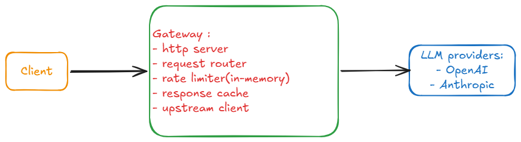

# LLM-Gateway

A Go API gateway that sits between your applications and LLM providers (OpenAI, Anthropic, and others). Clients talk to one stable endpoint; the gateway handles provider calls, guardrails, and observability so you can run LLM workloads in production without re-building the same plumbing in every app.

## Why this exists

Teams integrating LLMs often need the same cross-cutting concerns in every service:

- **Token-aware rate limiting** — cap usage per caller (v1: by user ID header), API key and tenant
- **Response caching** — avoid duplicate spend on identical requests
- **Retries** — exponential backoff on transient provider errors (post–v1)
- **Fallback routing** — switch models or providers when one path fails (post–v1)
- **Cost tracking** — attribute token spend per user or application (post–v1)
- **Request/response logging** — traces and metrics for debugging and compliance (post–v1)

This project centralizes those behaviors in one place so client apps stay thin and LLM usage stays manageable, measurable, and efficient.

## Status

**Early development.** The module layout and packages are in place; core handlers and provider integration are still being implemented.

## v1 scope

The first release is intentionally small:

| In scope | Out of scope (later) |
|----------|----------------------|
| `POST /v1/chat/completions` (OpenAI-compatible body) | Other routes / full OpenAI API surface |
| One provider (OpenAI) | Anthropic and other providers |
| No gateway authentication | API keys, JWT, mTLS |
| Rate limits per `X-User-ID` header | Per API key, global quotas |
| In-memory response cache (hash of request params) | Redis or shared cache |
| Non-streaming responses | Server-sent events / streaming |
| In-memory state only | Postgres, external rate-limit stores |

## API (v1)

**Endpoint:** `POST /v1/chat/completions`

**Headers:**

| Header | Required | Purpose |
|--------|----------|---------|
| `Content-Type: application/json` | Yes | OpenAI-compatible JSON body |
| `X-User-ID` | Yes | Identifies the caller for per-user rate limiting |

There is no gateway authentication in v1—any client that can reach the gateway may call it. Protect the gateway at the network layer (private VPC, reverse proxy, etc.) until auth ships in a later version.

**Example** (once the server is running):

```bash
curl -sS http://localhost:8080/v1/chat/completions \
  -H "Content-Type: application/json" \
  -H "X-User-ID: user-42" \
  -d '{
    "model": "gpt-4o-mini",
    "messages": [{"role": "user", "content": "Hello"}],
    "temperature": 0.7
  }'
```

### Rate limiting

Limits apply **per `X-User-ID`**. Requests without this header should be rejected (implementation TBD). Limits are held in memory and reset on process restart.

### Response cache

Cache hits are keyed by a **hash of the normalized request**: `model`, `messages`, `temperature`, and other parameters that affect the completion. Identical requests from the same or different users can share a cached response in v1.

## Architecture



Request path:

1. **HTTP server** — accepts `POST /v1/chat/completions`
2. **Request router** — validates body and required headers
3. **Rate limiter (in-memory)** — enforces quota using `X-User-ID`
4. **Response cache** — returns a stored response on cache hit
5. **Upstream client** — forwards misses to OpenAI

Later versions may add Anthropic and other providers on the right side of the diagram; v1 only wires OpenAI.

## Project layout

```
cmd/gateway/           # Application entrypoint
internal/server/       # HTTP server, routing, middleware
internal/proxy/        # Provider clients (e.g. OpenAI)
internal/ratelimit/    # Token-aware rate limiting
internal/cache/        # In-memory response cache
```

## Getting started

**Requirements:** Go 1.26+

```bash
git clone https://github.com/victornguyen247/LLM-GateWay.git
cd LLM-GateWay
go run ./cmd/gateway
```

**Configuration** (planned):

| Variable | Purpose |
|----------|---------|
| `OPENAI_API_KEY` | Provider credential for upstream calls |
| `GATEWAY_LISTEN` | Listen address (e.g. `:8080`) |

```bash
export OPENAI_API_KEY=sk-...
export GATEWAY_LISTEN=:8080
go run ./cmd/gateway
```

## License

MIT — see [LICENSE](LICENSE).
