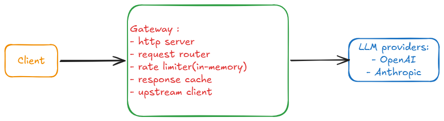

# LLM-Gateway

A Go API gateway that sits between your applications and LLM providers (OpenAI, Gemini, and others). Clients talk to one stable endpoint; the gateway handles provider calls, guardrails, and observability so you can run LLM workloads in production without re-building the same plumbing in every app.

## Why this exists

Teams integrating LLMs often need the same cross-cutting concerns in every service:

- **Token-aware rate limiting** — cap usage per caller (by API key / bearer token)
- **Response caching** — avoid duplicate spend on identical requests
- **Retries** — exponential backoff on transient provider errors (post–v2)
- **Fallback routing** — switch models or providers when one path fails (Phase D)
- **Cost tracking** — attribute token spend per user or application (post–v2)
- **Request/response logging** — traces and metrics for debugging and compliance

This project centralizes those behaviors in one place so client apps stay thin and LLM usage stays manageable, measurable, and efficient.

## Status

**v2 milestone complete (2026-09-27).** The gateway runs with in-memory or Redis backends for rate limiting and caching, deploys to kind with two replicas plus Redis, and demonstrates shared cache hits and a global rate-limit budget across pods. Streaming, multi-provider failover, and observability stacks are on the roadmap (see [gateway_progress_tracker.md](gateway_progress_tracker.md)).

## v2 milestone: shared state across replicas

### The problem

In v1, rate limits and the response cache lived inside each process. That works on a single instance, but it breaks the moment you scale horizontally. With *N* gateway replicas, an identical request could miss the cache on every pod except the one that happened to serve the first copy, so effective cache hit rate fell roughly with *1/N*. Rate limits were worse in a quieter way: each pod enforced its own token bucket, so a limit of “1 req/s per key” became **N × 1 req/s** cluster-wide — callers thought they had a global cap, but the gateway did not provide one.

### The solution

v2 moves shared state into Redis behind small interfaces at the package boundary: `ratelimit.Limiter` and `cache.Cache`. Implementations include in-memory (local dev) and Redis (multi-replica). Operators choose backends with `RATE_LIMIT_BACKEND` and `CACHE_BACKEND`; when either is `redis`, the process uses one shared `REDIS_URL` client (ping at boot — bad config fails loudly before traffic arrives). Keys are namespaced (`ratelimit:…`, `cache:…`) so the gateway can share a Redis instance safely.

### Evidence (kind, 2 gateway pods + Redis)

**Shared cache (C5):** same JSON body to pod A, then pod B (separate port-forwards). Pod A populates Redis; pod B serves without calling upstream.

```text
# Pod A (first request)
HTTP/1.1 200 OK
X-Cache: MISS

# Pod B (identical body)
HTTP/1.1 200 OK
X-Cache: HIT
```

**Shared rate limit (C6):** `RATE_LIMIT_RPS=1`, `RATE_LIMIT_BURST=1`, 10 round-robin requests with unique bodies (cache disabled for the test). Memory backend = per-pod buckets; Redis backend = one budget for the cluster.

| Backend | 200s / 10 reqs | 429s / 10 reqs | Effective rate |
|---------|----------------|----------------|----------------|
| memory  | ~10            | ~0             | ~2 × rps (broken at 2 replicas) |
| redis   | ~2             | ~8             | ~1 × rps (correct) |

Reproduce locally: see [Phase C instructions](.instructions/phase_C_instructions.md) (C5/C6) and `k8s/deployment.yaml` for env defaults.

## v1 scope (baseline)

The first release was intentionally small:

| In scope | Later phases |
|----------|----------------|
| `POST /v1/chat/completions` (OpenAI-compatible body) | Full API surface, streaming |
| OpenAI (+ Gemini in tree) | Multi-provider failover (Phase D) |
| Rate limits per bearer token | Per-tenant quotas, cost accounting |
| Exact-match response cache | Semantic cache (Phase H) |
| Memory or Redis backends (v2) | Postgres, external config stores |

## API

**Endpoint:** `POST /v1/chat/completions`

**Headers:**

| Header | Required | Purpose |
|--------|----------|---------|
| `Content-Type: application/json` | Yes | OpenAI-compatible JSON body |
| `Authorization: Bearer <token>` | Yes | Caller identity for rate limiting |

Protect the gateway at the network layer until dedicated gateway auth ships.

**Example:**

```bash
curl -sS http://localhost:8080/v1/chat/completions \
  -H "Content-Type: application/json" \
  -H "Authorization: Bearer demo-key" \
  -d '{
    "model": "gpt-4o-mini",
    "messages": [{"role": "user", "content": "Hello"}],
    "temperature": 0.7
  }'
```

### Rate limiting

Limits apply **per bearer token** (authorization key). Backends: `memory` (single replica) or `redis` (shared across replicas). Middleware may fail open on backend errors; Redis outages should be visible in logs.

### Response cache

Cache hits are keyed by a **hash of normalized request parameters** (`model`, `messages`, `temperature`, etc.). Backends: `memory` or `redis`. Responses include `X-Cache: HIT` or `MISS`.

## Architecture

**v1 (single replica):**



**v2 (kind — 2 replicas + Redis):**


Request path:

1. **HTTP server** — `GET /health`, `POST /v1/chat/completions`
2. **Logging middleware** — structured JSON (`slog`), optional `pod` from `POD_NAME`
3. **Rate limiter** — `Limiter.Allow` (memory or Redis)
4. **Response cache** — return stored response on hit
5. **Upstream proxy** — OpenAI / Gemini on miss

## Project layout

```
cmd/gateway/           # Application entrypoint, config, DI
internal/server/       # HTTP server, routing, middleware
internal/proxy/        # Provider clients (OpenAI, Gemini)
internal/ratelimit/    # Limiter interface, memory + Redis
internal/cache/        # Cache interface, memory + Redis
k8s/                   # Deployment, Service, Redis StatefulSet, kind config
```

## Getting started

**Requirements:** Go 1.26+, optional Docker / kind for Redis and cluster demos

```bash
git clone https://github.com/victornguyen247/LLM-GateWay.git
cd LLM-GateWay
export OPENAI_API_KEY=sk-...
go run ./cmd/gateway
```

**Configuration:**

| Variable | Default | Purpose |
|----------|---------|---------|
| `OPENAI_API_KEY` | — | Upstream OpenAI credential |
| `GATEWAY_LISTEN` | `:8080` | Listen address |
| `RATE_LIMIT_BACKEND` | `memory` | `memory` or `redis` |
| `RATE_LIMIT_RPS` | `2` | Memory backend: token bucket rate |
| `RATE_LIMIT_BURST` | `2` | Memory backend: burst |
| `RATE_LIMIT_WINDOW` | `1s` | Redis backend: window size |
| `RATE_LIMIT_LIMIT` | same as RPS | Redis backend: max requests per window |
| `CACHE_BACKEND` | `memory` | `memory` or `redis` |
| `CACHE_SIZE` | `1000` | Memory cache capacity |
| `CACHE_TTL` | `1h` | Entry TTL |
| `REDIS_URL` | `redis://localhost:6379` | Used when either backend is `redis` |
| `POD_NAME` | — | Optional; added to logs (Kubernetes downward API) |

**Local stack with Redis:**

```bash
docker compose up -d redis
export RATE_LIMIT_BACKEND=redis CACHE_BACKEND=redis REDIS_URL=redis://localhost:6379
go run ./cmd/gateway
```

## Run with Docker

```bash
docker build -t llm-gateway:v0.2 .
docker run --rm -p 8080:8080 -e OPENAI_API_KEY=$OPENAI_API_KEY llm-gateway:v0.2
```

## kind (2 replicas + Redis)

```bash
kind create cluster --config k8s/kind-cluster.yaml
docker build -t llm-gateway:v0.2 .
kind load docker-image llm-gateway:v0.2 --name gateway-dev
kubectl create secret generic gateway-secret --from-literal=OPENAI_API_KEY=$OPENAI_API_KEY
kubectl apply -f k8s/
kubectl port-forward svc/llm-gateway 8080:80
```

## License

MIT — see [LICENSE](LICENSE).
